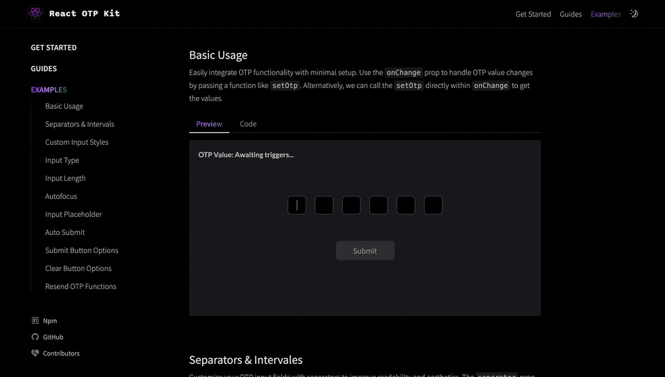

# react-otp-kit

 []()  []()  []() 

A lightweight and versatile component designed to simplify the implementation of OTP (One-Time Password) input fields in React applications for desktop and mobile.




[Live Demo](https://react-otp-kit.vercel.app/examples)

## Installation

To install the latest stable version:
```sh
npm install --save react-otp-kit
```

## Basic Usage

```jsx
import { useState } from "react";
import { OtpKit } from "react-otp-kit";
import "react-otp-kit/dist/styles.css";

function App() {
  const [otp, setOtp] = useState("");

  const handleChange = (newOtp: string) => {
    setOtp(newOtp);
  };

  return (
    <>
      <OtpKit
        value={otp}
        onChange={handleChange}
        type={"number"}
      />
    </>
  );
};

export default App;

```

To include the styles in your main file:
```jsx
import 'react-otp-kit/dist/styles.css'

```


## API

### Props

| Name             | Type                                                   | Required | Default                              | Description                                                                                                                                                         | Status       |
|------------------|--------------------------------------------------------|----------|--------------------------------------|---------------------------------------------------------------------------------------------------------------------------------------------------------------------|--------------|
| value            | `string`                                               | Yes      | -                                    | The current value of the OTP input.                                                                                                                                 | Stable       |
| onChange         | `(value: string) => void`                              | Yes      | -                                    | Callback function triggered when the OTP value changes.                                                                                                             | Stable       |
| numOfInputs      | `number`                                               | No       | `6`                                  | Number of OTP input fields to display.                                                                                                                               | Stable       |
| placeholder      | `string`                                               | No       | -                                    | Placeholder text for the OTP input fields.                                                                                                                           | Stable       |
| autoSubmit       | `boolean`                                              | No       | `false`                              | Automatically submit the OTP when all input fields are filled.                                                                                                       | Stable       |
| autoFocus        | `boolean`                                              | No       | `true`                               | Automatically focus on the first OTP input field on component mount.                                                                                                 | Stable       |
| separator        | `Object`                                               | No       | -                                    | Configuration for displaying separators between OTP input fields.                                                                                                    | Stable |
| separator.show   | `boolean`                                              | No       | -                                    | Show separators between input fields.                                                                                                                                | Stable |
| separator.value  | `string`                                               | No       | -                                    | The value to display as a separator.                                                                                                                                 | Stable |
| separator.intervals | `number`                                           | Yes      | -                                    | The intervals at which separators should be displayed.                                                                                                               | Stable |
| separator.className | `string`                                           | No       | -                                    | CSS class for styling the separator.                                                                                                                                 | Stable |
| submitOtpButton  | `Object`                                               | No       | Default Submit Button Config         | Configuration for the submit OTP button.                                                                                                                             | Stable       |
| submitOtpButton.show | `boolean`                                         | No       | `true`                               | Show the submit OTP button.                                                                                                                                         | Stable       |
| submitOtpButton.text | `string`                                          | No       | `Submit`                             | Text to display on the submit OTP button.                                                                                                                            | Stable       |
| submitOtpButton.className | `string`                                     | No       | `rok__submit_button`                 | CSS class for styling the submit OTP button.                                                                                                                         | Stable       |
| clearOtpButton   | `Object`                                               | No       | Default Clear Button Config          | Configuration for the clear OTP button.                                                                                                                              | Stable       |
| clearOtpButton.show | `boolean`                                          | No       | `false`                              | Show the clear OTP button.                                                                                                                                          | Stable       |
| clearOtpButton.text | `string`                                           | No       | `Clear`                              | Text to display on the clear OTP button.                                                                                                                             | Stable       |
| clearOtpButton.className | `string`                                      | No       | `rok__clear_button`                  | CSS class for styling the clear OTP button.                                                                                                                          | Stable       |
| type             | `"number" \| "text" \| "password"`                     | Yes      | -                                    | The type of the OTP input fields (number, text, or password).                                                                                                        | Stable       |
| inputStyles      | `Object`                                               | No       | -                                    | Custom styles for the OTP input fields.                                                                                                                              | Stable       |
| inputStyles.generalStyles | `string`                                     | No       | `rok__input--defaultStyles`          | General CSS class for styling the OTP input fields.                                                                                                                  | Stable       |
| inputStyles.onFill | `string`                                            | No       | `rok__defaultFill`                   | CSS class for styling the OTP input fields when they are filled.                                                                                                     | Stable       |

### ResendCode Props

| Name                        | Type                                                   | Required | Default                          | Description                                                                                                                                                       | Status       |
|-----------------------------|--------------------------------------------------------|----------|----------------------------------|-------------------------------------------------------------------------------------------------------------------------------------------------------------------|--------------|
| resendOtpButton             | `Object`                                               | Yes      | -                                | Configuration for the resend OTP button.                                                                                                                           | Stable       |
| resendOtpButton.localFunctions | `() => any`                                        | No       | -                                | Function to call for local OTP generation.                                                                                                                         | Stable       |
| resendOtpButton.apiURL      | `string`                                               | No       | -                                | API URL for fetching a new OTP.                                                                                                                                   | Stable       |
| resendOtpButton.initialCountdown | `number`                                         | No       | `60`                             | Initial countdown time for the resend button in seconds.                                                                                                           | Stable       |
| resendOtpButton.show        | `boolean`                                              | No       | `true`                           | Show the resend OTP button.                                                                                                                                       | Stable       |
| resendOtpButton.text        | `string`                                               | No       | `Resend code`                    | Text to display on the resend OTP button.                                                                                                                          | Stable       |
| resendOtpButton.className   | `string`                                               | No       | `rok__resend_button`             | CSS class for styling the resend OTP button.                                                                                                                       | Stable       |
| resendOtpButton.responseData | `(data: any) => void`                                | No       | -                                | Callback function to handle the response data from the OTP generation function or API.                                                                             | Stable       |

## ResendCode Button & Timer
```jsx

import { useState } from "react";
import { OtpKitResendCode } from "react-otp-kit";

function App() {
   const [localOtp, setLocalOtp] = useState("");
  const [apiOtp, setApiOtp] = useState("");

  const handleLocalResponseData = (data: any) => {
    setLocalOtp(data);
  };

  const handleApiResponseData = (data: any) => {
    setApiOtp(data.otp);
  };

  // Example: locally generating random codes as OTP
  const generateRandomDigits = () => {
    let result = "";
    const characters = "0123456789";
    const length = 6;
    for (let i = 0; i < length; i++) {
      result += characters.charAt(
        Math.floor(Math.random() * characters.length)
      );
    }
    return result;
  };

  return (
    <>
      <OtpKitResendCode
        resendOtpButton={{
          localFunctions: generateRandomDigits,
          initialCountdown: 10,
          text: "Resend code (Local)",
          className: "resendbutton__styles",
          responseData: handleLocalResponseData, // Pass the function to handle response data
        }}
      />
      <p>Generated Local OTP: {localOtp}</p>
      <OtpKitResendCode
        resendOtpButton={{
          apiURL:
            "https://run.mocky.io/v3/5b8c2be7-ae6d-4ca4-9ece-fe5d96fdb120",
          initialCountdown: 10,
          text: "Resend code (API)",
          className: "resendbutton__styles",
          responseData: handleApiResponseData, // Pass the function to handle response data
        }}
      />
      <p>Generated API OTP: {apiOtp}</p>
    </>
  );
};

export default App
```

### ⚠️ Warning
To ensure proper functionality, avoid overriding the following props on the input component returned from the renderInput prop. Modifying these props can result in unexpected behavior:

- `ref`
- `value`
- `onChange`
- `onFocus`
- `onBlur`
- `onKeyDown`
- `onPaste`
- `onInput`
- `type`
- `inputMode`

### Contributing  

We welcome contributions from the community to improve the React OTP Kit. Whether you want to report bugs, suggest new features, or submit pull requests, your involvement is highly appreciated. Please refer to our [contributing guidelines](CONTRIBUTING.md) for more information on how to get started.

### License 

This project is licensed under the MIT License. For more details, please refer to the [LICENSE](LICENSE) file.

### Contributors 

A big thank you to all the contributors who have helped make this project better. Your contributions are what make this project possible. If you’d like to see your name on this list, check out our [contributing guidelines](CONTRIBUTING.md) and get involved!

[](https://github.com/keys78/react-otp-kit/graphs/contributors)

#### Contributors
- [keys78](https://github.com/keys78)
- [Hannahadora](https://github.com/Hannahadora)